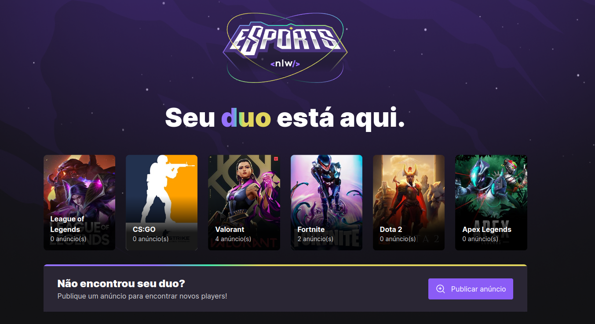
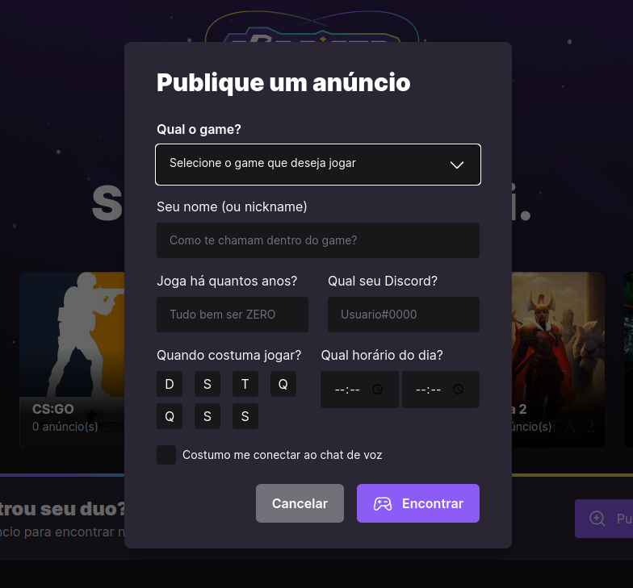
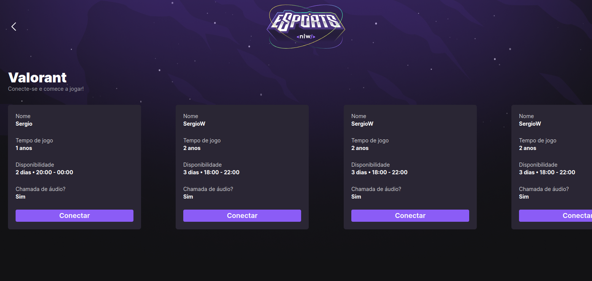
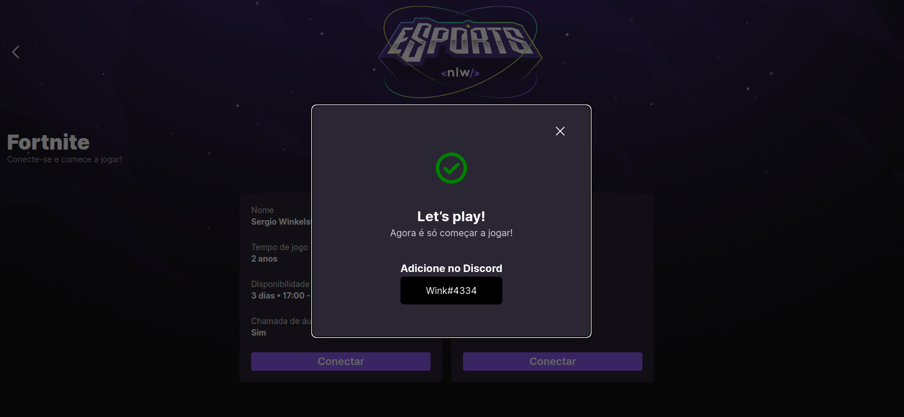

## NLW eSports Web

Encontre o seu duo e se divirta em seus jogos favoritos!!!

## Tecnologias

Aqui estão algumas das tecnologias usadas neste projeto.

- ReactJS
- Radix-ui
- Axios
- Tailwindcss
- React Router Dom
- Typescript
- Phosphor Icons
- Vite
- Swiper

## Layout

Você pode visualizar o layout do projeto original através deste [Link](<https://www.figma.com/file/bWu7YTtbeLwr9bdLarCeT9/NLW-eSports-(Community)?node-id=6%3A23>). **_Você precisa de uma conta Figma para acessá-lo._**

## Para visualizar o projeto funcionando, clique no link abaixo !

[https://nlw-e-sports-ignite-web.vercel.app/]

## Como usar

### 1 -Ao acessar, você verá a página Home

### 2 -Na página Home você poderá publicar anúncios

### 3 -Ou poderá acessar os anúncios existentes clicando nos banners dos jogos

### 4 -E assim você poderá se conectar com alguma pessoa

## Autor

- **Sergio Winkelstroter**
